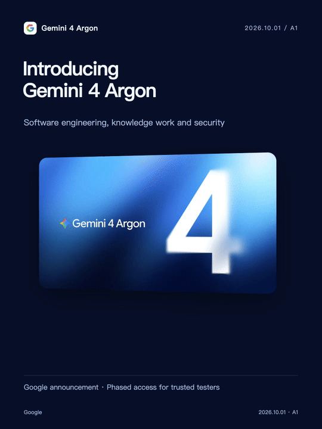
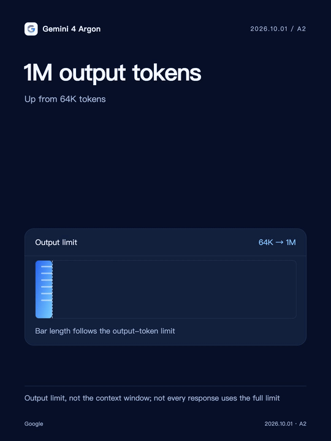
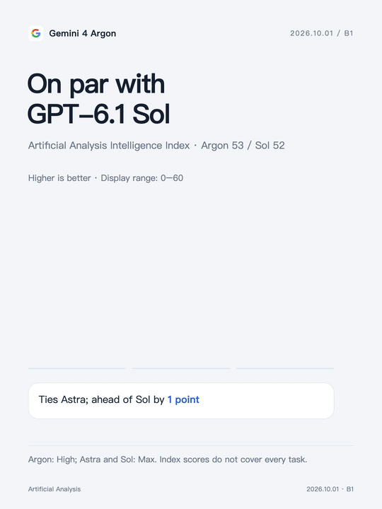
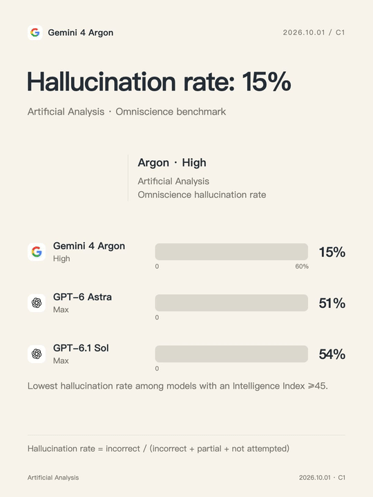
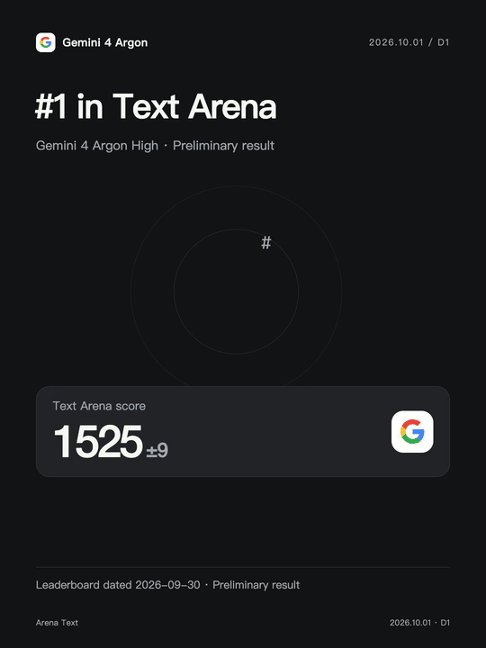
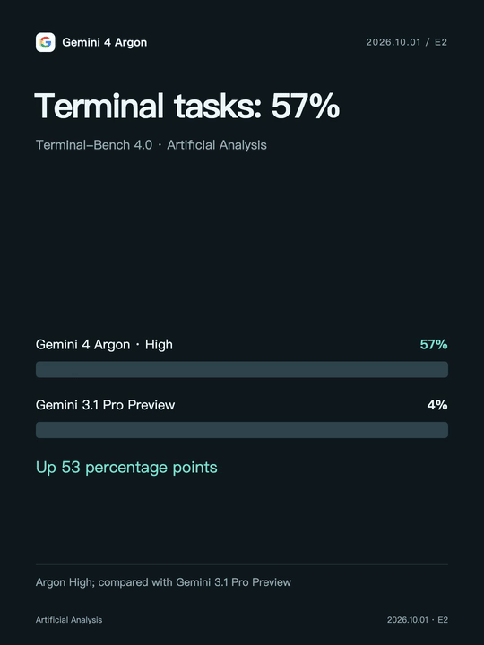

# LiveCanvas

[简体中文](README.md) | **English**

**Turn a sentence into a Live Photo with a designed cover and animation.**

An agent skill for Codex, Claude Code, and other compatible assistants: **research → storyboard → Remotion animation → previews & Apple Live Photo resources**. Use images, emoji, scenes, timelines, and charts.

## Demos

15 demos with single-column GIF previews. Full-resolution MP4 links appear below each image; the six Gemini 4 Argon cards also include Live Photo downloads.

[Gemini 4 Argon](#introducing-gemini-4-argon) · [More demos](#population) · [Install](#install) · [简体中文](README.md#作品演示)

### Xiaomi market cap


[Full-resolution MP4](docs/demos/en/xiaomi.mp4)

### A20 Pro vs A19 Pro


[Full-resolution MP4](docs/demos/en/a20-pro.mp4)

### Introducing Gemini 4 Argon



Engineering, knowledge work and security; phased access for trusted testers.

[Full-resolution MP4](docs/demos/en/gemini-argon-intro.mp4) · [Download Live Photo](docs/demos/en/gemini-argon-intro.pvt.zip)

### 1M output tokens



The output limit rises from 64K to 1M tokens.

[Full-resolution MP4](docs/demos/en/gemini-argon-output.mp4) · [Download Live Photo](docs/demos/en/gemini-argon-output.pvt.zip)

### On par with GPT-6.1 Sol



Artificial Analysis Intelligence Index: Argon 53, Astra 53, Sol 52.

[Full-resolution MP4](docs/demos/en/gemini-argon-performance.mp4) · [Download Live Photo](docs/demos/en/gemini-argon-performance.pvt.zip)

### Hallucination rate: 15%



Artificial Analysis Omniscience: Argon 15%, Astra 51%, Sol 54%.

[Full-resolution MP4](docs/demos/en/gemini-argon-hallucination.mp4) · [Download Live Photo](docs/demos/en/gemini-argon-hallucination.pvt.zip)

### #1 in Text Arena



1525 points and 4,942 votes; ranked first, with preliminary results.

[Full-resolution MP4](docs/demos/en/gemini-argon-arena.mp4) · [Download Live Photo](docs/demos/en/gemini-argon-arena.pvt.zip)

### Terminal tasks: 57%



Terminal-Bench 4.0: Argon 57%, versus 4% for Gemini 3.1 Pro Preview.

[Full-resolution MP4](docs/demos/en/gemini-argon-terminal.mp4) · [Download Live Photo](docs/demos/en/gemini-argon-terminal.pvt.zip)

### Population


[Full-resolution MP4](docs/demos/en/population.mp4)

### Coffee stores


[Full-resolution MP4](docs/demos/en/coffee.mp4)

### NEV adoption


[Full-resolution MP4](docs/demos/en/nev.mp4)

### High-speed rail


[Full-resolution MP4](docs/demos/en/rail.mp4)

### Two-city temperatures


[Full-resolution MP4](docs/demos/en/weather.mp4)

### Olympic gold


[Full-resolution MP4](docs/demos/en/olympics.mp4)

### Electricity mix


[Full-resolution MP4](docs/demos/en/energy.mp4)

Data is a production-time snapshot, not a live feed. Gemini sources were checked on 2026-10-01; Text Arena is dated 2026-09-30. See [demo notes](docs/DEMOS.en.md) for sources and definitions.

## Install

Requires Node.js / npm. Install with the [Skills CLI](https://github.com/vercel-labs/skills) and select your agent:

```bash
npx skills add pengchujin/livecanvas --skill livecanvas -g
```

For Codex only:

```bash
npx skills add pengchujin/livecanvas --skill livecanvas -g -a codex
```

Start a new chat after installation:

```text
Use LiveCanvas to compare last year’s temperatures in Beijing and Shanghai.
Create the content in English with city illustrations and seasonal emoji.
Design a complete cover and deliver an animated preview.
```

<details>
<summary>Manual installation for Codex</summary>

Clone or download this repository. Copy the entire `livecanvas/` folder to `~/.codex/skills/` (or `$CODEX_HOME/skills/` if configured), then start a new chat. Do not copy only SKILL.md.

Copy the sibling `livechart/` folder too if you need the legacy `$livechart` alias.

</details>

## Requirements & output

- **Animation:** An agent with web research and code execution; Node.js, Python 3, FFmpeg, and fonts for the content’s language. Install project dependencies with `npm ci`.
- **Live Photo:** Pairing also requires macOS and Xcode Command Line Tools. The current tool accepts silent H.264 video and JPEG images.
- **Delivery:** Cover, MP4, sources, editable project, and a `.pvt` resource package where supported. No automatic Photos import.

A `.pvt` bundles paired photo/video resources and metadata; iPhone Files may not preview it. README animations are GIFs, not native Live Photos.

The template pins Remotion 4.0.530. See the [production guide (Chinese)](livecanvas/references/production.md) for manual rendering and packaging commands.

## License & credits

Skill code and documentation are [MIT licensed](LICENSE). Demo media and third-party assets have [separate attribution and terms (Chinese)](THIRD_PARTY_NOTICES.md). Remotion retains [its own license](https://github.com/remotion-dev/remotion/blob/main/LICENSE.md).

Motion design draws on [Emil Kowalski’s animate skill](https://github.com/emilkowalski/skills/blob/main/skills/animate/SKILL.md). Emoji graphics are from [Twemoji](https://github.com/twitter/twemoji).
