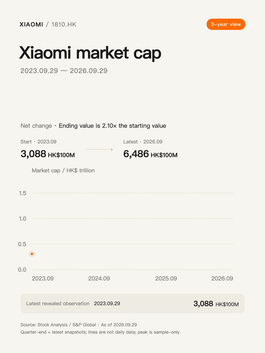
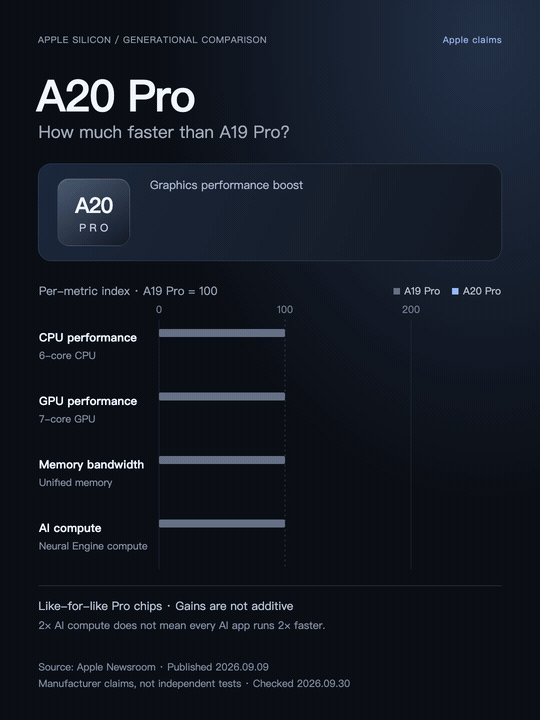
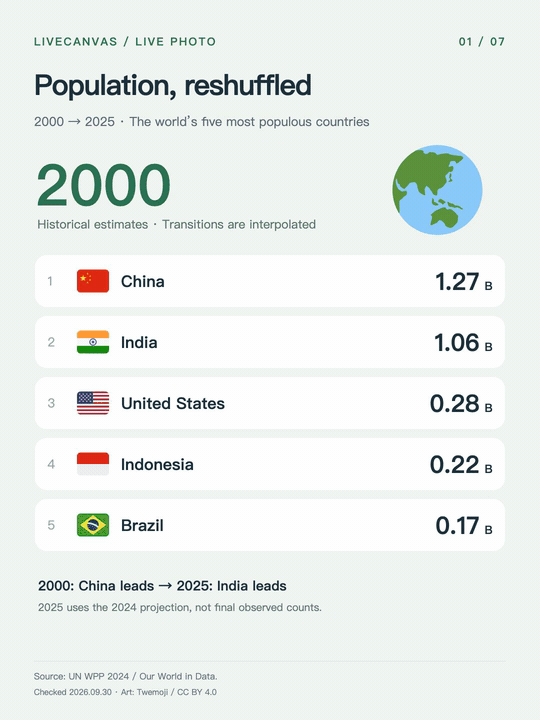
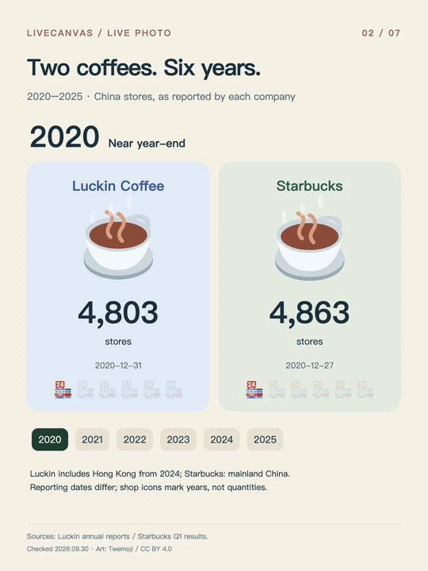
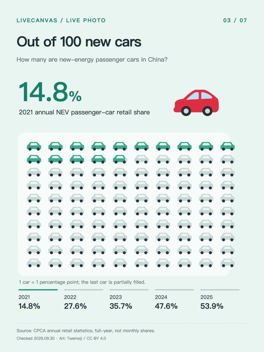
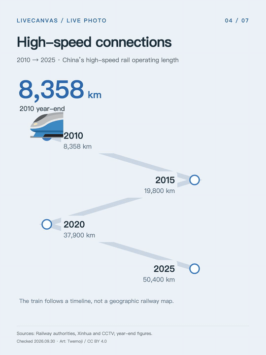
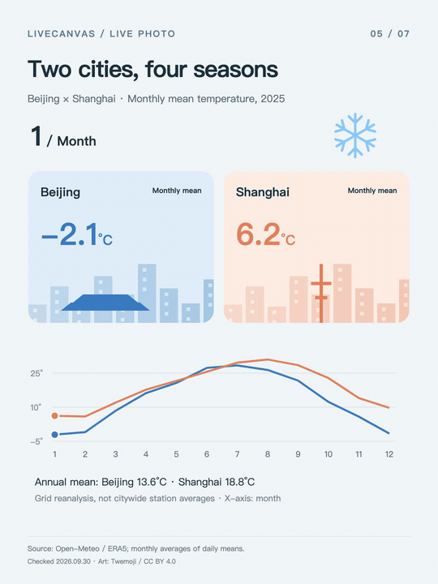
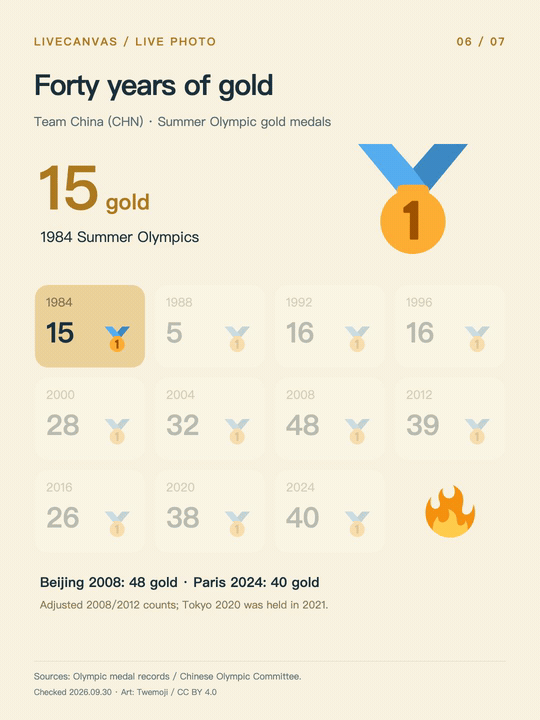
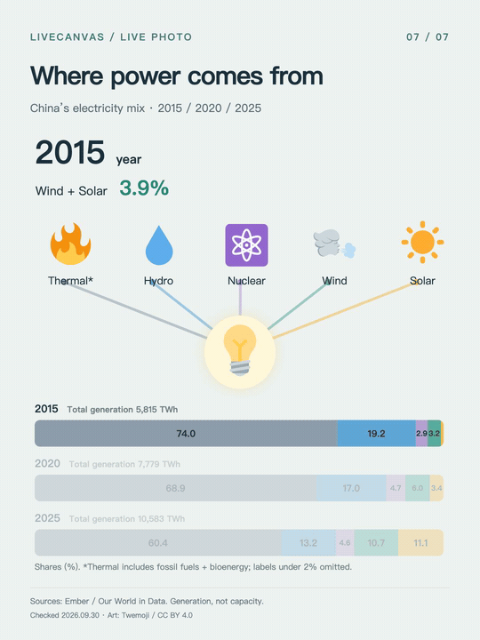

# LiveCanvas

[简体中文](README.md) | **English**

**Turn a sentence into a Live Photo with a designed cover and animation.**

An agent skill for Codex, Claude Code, and other compatible assistants: **research → storyboard → Remotion animation → previews & Apple Live Photo resources**. Use images, emoji, scenes, timelines, and charts.

## Demos

Nine English demos. GIFs loop inline; click a title for the full-resolution MP4. Switch to [Chinese](README.md) to see the Chinese editions.

| [Xiaomi market cap](docs/demos/en/xiaomi.mp4) | [A20 Pro vs A19 Pro](docs/demos/en/a20-pro.mp4) | [Population](docs/demos/en/population.mp4) |
| :---: | :---: | :---: |
|  |  |  |

| [Coffee stores](docs/demos/en/coffee.mp4) | [NEV adoption](docs/demos/en/nev.mp4) | [High-speed rail](docs/demos/en/rail.mp4) |
| :---: | :---: | :---: |
|  |  |  |

| [Two-city temperatures](docs/demos/en/weather.mp4) | [Olympic gold](docs/demos/en/olympics.mp4) | [Electricity mix](docs/demos/en/energy.mp4) |
| :---: | :---: | :---: |
|  |  |  |

Data is a production-time snapshot, not a live feed. See [demo notes](docs/DEMOS.en.md) for sources and definitions.

## Install

Requires Node.js / npm. Install with the [Skills CLI](https://github.com/vercel-labs/skills) and select your agent:

```bash
npx skills add pengchujin/livecanvas --skill livecanvas -g
```

For Codex only:

```bash
npx skills add pengchujin/livecanvas --skill livecanvas -g -a codex
```

Start a new chat after installation:

```text
Use LiveCanvas to compare last year’s temperatures in Beijing and Shanghai.
Create the content in English with city illustrations and seasonal emoji.
Design a complete cover and deliver an animated preview.
```

<details>
<summary>Manual installation for Codex</summary>

Clone or download this repository. Copy the entire `livecanvas/` folder to `~/.codex/skills/` (or `$CODEX_HOME/skills/` if configured), then start a new chat. Do not copy only SKILL.md.

Copy the sibling `livechart/` folder too if you need the legacy `$livechart` alias.

</details>

## Requirements & output

- **Animation:** An agent with web research and code execution; Node.js, Python 3, FFmpeg, and fonts for the content’s language. Install project dependencies with `npm ci`.
- **Live Photo:** Pairing also requires macOS and Xcode Command Line Tools. The current tool accepts silent H.264 video and JPEG images.
- **Delivery:** Cover, MP4, sources, editable project, and a `.pvt` resource package where supported. No automatic Photos import.

A `.pvt` bundles paired photo/video resources and metadata; iPhone Files may not preview it. README animations are GIFs, not native Live Photos.

The template pins Remotion 4.0.530. See the [production guide (Chinese)](livecanvas/references/production.md) for manual rendering and packaging commands.

## License & credits

Skill code and documentation are [MIT licensed](LICENSE). Demo media and third-party assets have [separate attribution and terms (Chinese)](THIRD_PARTY_NOTICES.md). Remotion retains [its own license](https://github.com/remotion-dev/remotion/blob/main/LICENSE.md).

Motion design draws on [Emil Kowalski’s animate skill](https://github.com/emilkowalski/skills/blob/main/skills/animate/SKILL.md). Emoji graphics are from [Twemoji](https://github.com/twitter/twemoji).
