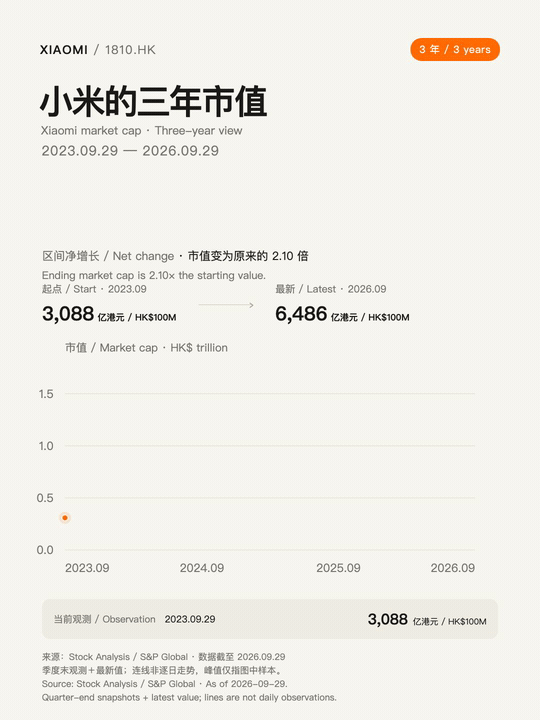
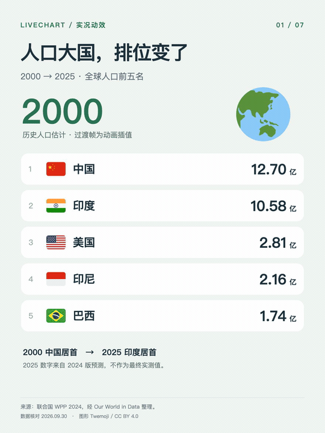
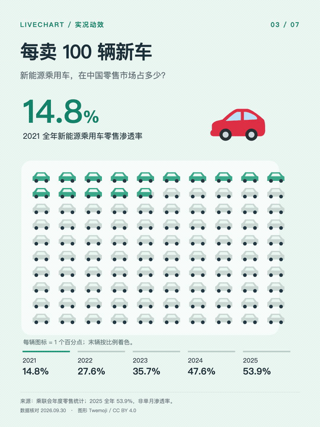
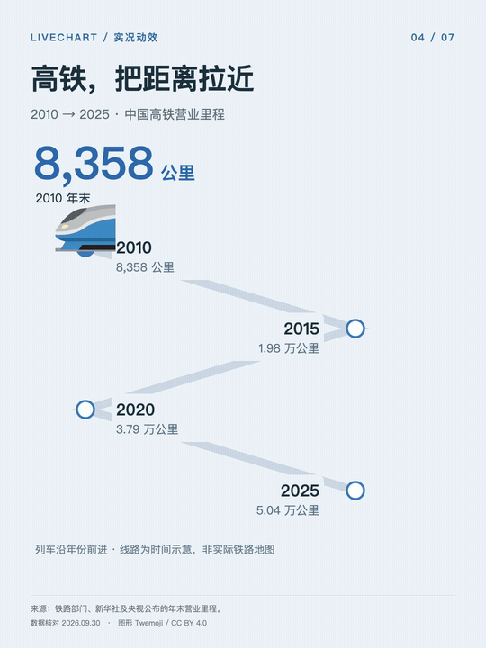
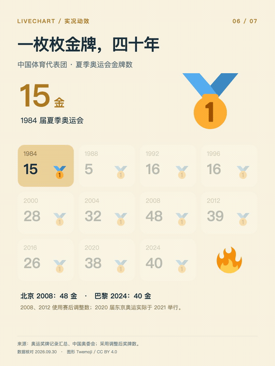
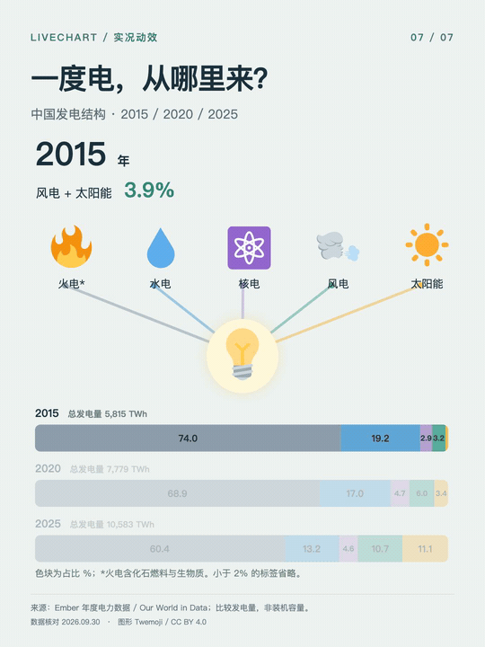

# LiveCanvas · 实况画布

**把一句话，做成有封面、有图片、有动画的 Live Photo 信息卡。**

Turn a prompt into an animated information card with a designed cover, imagery, and Apple Live Photo resources.

一个适用于 Codex、Claude Code 等 AI 编程助手的 skill：**搜索核实 → 设计分镜 → Remotion 动画 → 预览与 Live Photo 资源**。支持图片、emoji、场景、时间线和图表。

An agent skill for Codex, Claude Code, and other compatible assistants: **research → storyboard → Remotion animation → previews & Live Photo resources**. Use images, emoji, scenes, timelines, and charts.

## 作品演示 · Demos

9 张中英双语作品，GIF 直接循环播放；点击标题查看高清 MP4。

Nine bilingual demos. GIFs loop inline; click a title for the full-resolution MP4.

| [小米市值 / Xiaomi market cap](docs/demos/xiaomi.mp4) | [A20 Pro vs A19 Pro](docs/demos/a20-pro.mp4) | [全球人口 / Population](docs/demos/population.mp4) |
| :---: | :---: | :---: |
|  |  |  |

| [咖啡门店 / Coffee stores](docs/demos/coffee.mp4) | [新能源车 / NEV adoption](docs/demos/nev.mp4) | [中国高铁 / High-speed rail](docs/demos/rail.mp4) |
| :---: | :---: | :---: |
|  |  |  |

| [双城气温 / Two-city temperatures](docs/demos/weather.mp4) | [奥运金牌 / Olympic gold](docs/demos/olympics.mp4) | [发电结构 / Electricity mix](docs/demos/energy.mp4) |
| :---: | :---: | :---: |
|  |  |  |

数据口径与素材署名见 [演示说明 / Demo notes](docs/DEMOS.md)。数据为制作时的快照，不会自动更新。

See the demo notes for sources and definitions. Data is a production-time snapshot, not a live feed.

## 安装 · Install

需要 Node.js / npm。使用 [Skills CLI](https://github.com/vercel-labs/skills) 安装，并选择你的 AI 助手。

Requires Node.js / npm. Run the command and select your agent:

```bash
npx skills add pengchujin/livecanvas --skill livecanvas -g
```

只装到 Codex / Install for Codex only:

```bash
npx skills add pengchujin/livecanvas --skill livecanvas -g -a codex
```

安装后新建对话，输入 / Start a new chat after installation:

```text
用 LiveCanvas 做北京和上海去年全年气温变化。
加入城市插画和季节 emoji，设计完整封面，并提供动态预览。

Use LiveCanvas to compare last year’s temperatures in Beijing and Shanghai.
Add city illustrations and seasonal emoji, design a complete cover,
and deliver an animated preview with Live Photo resources when supported.
```

<details>
<summary>手动安装到 Codex / Manual installation</summary>

下载或克隆本仓库，把整个 `livecanvas/` 文件夹放入 `~/.codex/skills/`；若设置了 `CODEX_HOME`，则放入该目录下的 `skills/`。不要只复制 SKILL.md。随后新建对话。

需要兼容旧的 `$livechart` 调用时，再把 `livechart/` 文件夹放到同一位置。

Clone or download this repository. Copy the entire `livecanvas/` folder to `~/.codex/skills/` (or `$CODEX_HOME/skills/` if configured), then start a new chat. Copy the sibling `livechart/` folder too only if you need the legacy alias.

</details>

## 运行与交付 · Requirements & output

| | 中文 | English |
| --- | --- | --- |
| 动画 / Animation | 助手需能联网搜索和执行代码；需 Node.js、Python 3、FFmpeg、中文字体。`npm ci` 安装依赖。 | An agent with web research and code execution; Node.js, Python 3, FFmpeg, and Chinese fonts. Install project dependencies with `npm ci`. |
| Live Photo | 配对封装额外需要 macOS 和 Xcode Command Line Tools。当前工具支持无声 H.264 + JPEG。 | Pairing requires macOS and Xcode Command Line Tools. The current tool accepts silent H.264 + JPEG. |
| 交付 / Output | 封面、MP4、数据来源、可编辑工程及支持环境下的 `.pvt` 资源包；不自动导入相册。 | Cover, MP4, sources, editable project, and a `.pvt` resource package where supported. No automatic Photos import. |

**格式说明 / Format note:** `.pvt` 包含配对照片、视频及元数据，iPhone「文件」App 未必能直接预览。README 使用 GIF 展示动效，GIF 不是原生 Live Photo。

A `.pvt` bundles paired photo/video resources and metadata; iPhone Files may not preview it. README animations are GIFs, not native Live Photos. Web playback, saving to Photos, and native iPhone playback are separate capabilities that need separate validation.

模板使用 Remotion 4.0.530。手动渲染与封装步骤见 [运行指南](livecanvas/references/production.md)。

The template pins Remotion 4.0.530. See the [production guide (Chinese)](livecanvas/references/production.md) for manual rendering and packaging commands.

## 许可与致谢 · License & credits

代码及 skill 文档采用 [MIT](LICENSE)；演示媒体与第三方素材许可见 [署名说明](THIRD_PARTY_NOTICES.md)。Remotion 适用其[自身许可证](https://github.com/remotion-dev/remotion/blob/main/LICENSE.md)。

动效设计参考 [Emil Kowalski / animate](https://github.com/emilkowalski/skills/blob/main/skills/animate/SKILL.md)，图标采用 [Twemoji](https://github.com/twitter/twemoji)。

Skill code and documentation are [MIT licensed](LICENSE). Demo media and third-party assets have [separate attribution and terms](THIRD_PARTY_NOTICES.md); Remotion retains its own license. Motion design draws on Emil Kowalski’s animate skill; emoji graphics are from Twemoji.
