# LiveCanvas · 实况画布

**简体中文** | [English](README.en.md)

**一句话，做成有封面、有动画的 Live 图**

一个适用于 Codex、Claude Code 等 AI 编程助手的 skill：**搜索核实 → 设计分镜 → Remotion 动画 → 预览与 Apple Live Photo 资源**。支持图片、emoji、场景、时间线和图表。

## 作品演示

15 张作品，单列 GIF 动态预览。每张图下方提供高清 MP4，Gemini 4 Argon 的 6 张另附 Live Photo 下载。

[Gemini 4 Argon](#gemini-4-argon-登场) · [更多作品](#全球人口) · [安装方法](#安装) · [English](README.en.md#demos)

### 小米市值

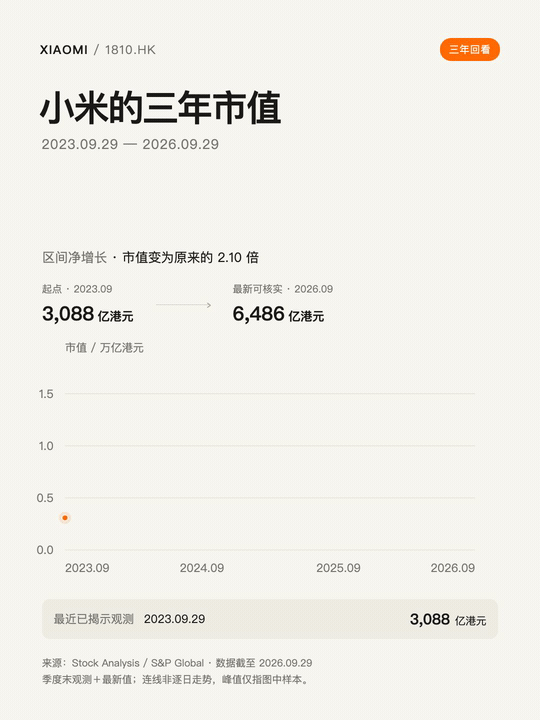

[高清 MP4](docs/demos/zh/xiaomi.mp4)

### A20 Pro vs A19 Pro

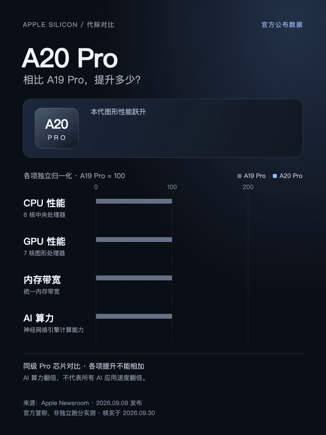

[高清 MP4](docs/demos/zh/a20-pro.mp4)

### Gemini 4 Argon 登场

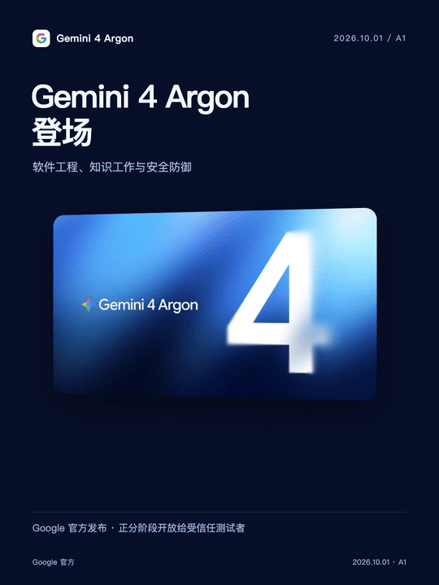

软件工程、知识工作与安全防御；分阶段开放给受信任测试者。

[高清 MP4](docs/demos/zh/gemini-argon-intro.mp4) · [下载 Live Photo](docs/demos/zh/gemini-argon-intro.pvt.zip)

### 1M 输出上限

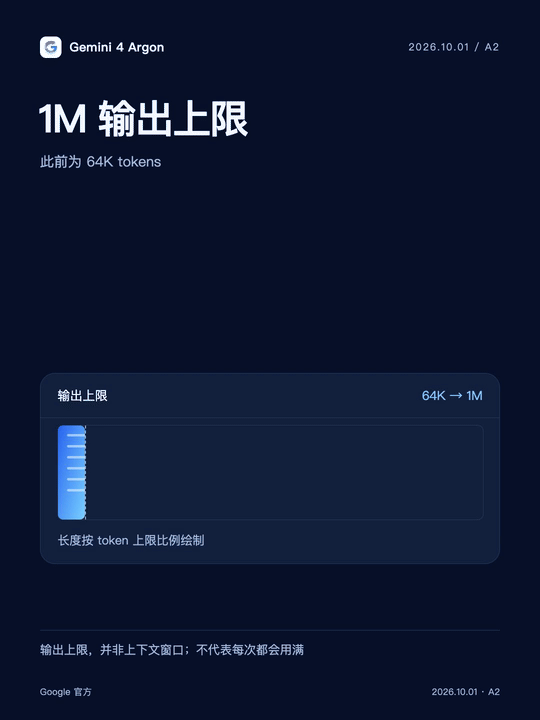

单次输出上限从 64K 提高到 1M tokens。

[高清 MP4](docs/demos/zh/gemini-argon-output.mp4) · [下载 Live Photo](docs/demos/zh/gemini-argon-output.pvt.zip)

### 比肩 GPT-6.1 Sol

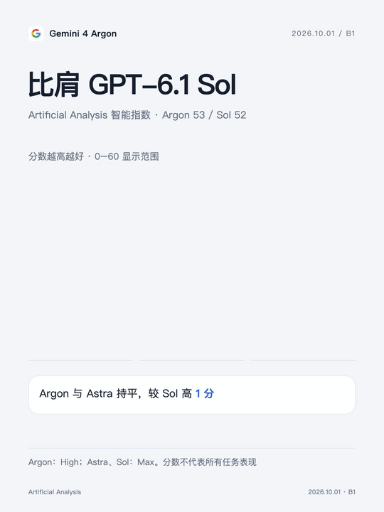

Artificial Analysis 智能指数：Argon 53 分，Astra 53 分，Sol 52 分。

[高清 MP4](docs/demos/zh/gemini-argon-performance.mp4) · [下载 Live Photo](docs/demos/zh/gemini-argon-performance.pvt.zip)

### 更少幻觉：15%

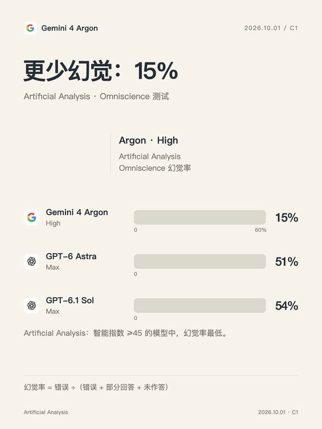

Artificial Analysis Omniscience：Argon 15%，Astra 51%，Sol 54%。

[高清 MP4](docs/demos/zh/gemini-argon-hallucination.mp4) · [下载 Live Photo](docs/demos/zh/gemini-argon-hallucination.pvt.zip)

### Text Arena 第一

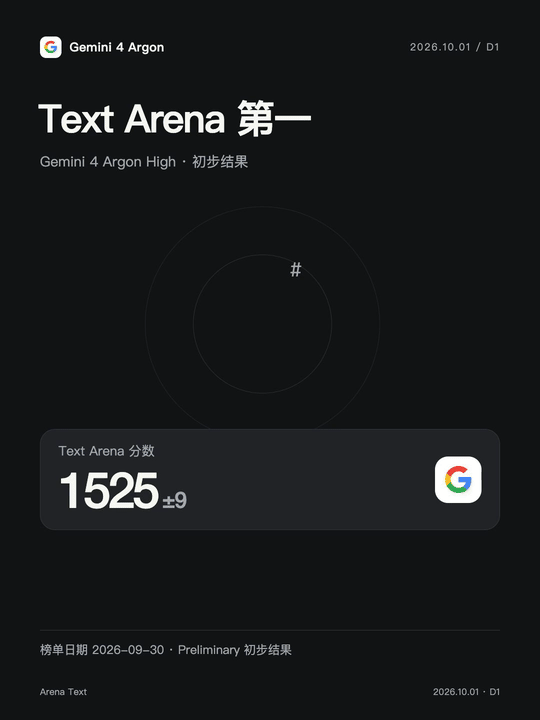

1525 分、4,942 票，暂列第一；目前为初步结果。

[高清 MP4](docs/demos/zh/gemini-argon-arena.mp4) · [下载 Live Photo](docs/demos/zh/gemini-argon-arena.pvt.zip)

### 终端任务 57%

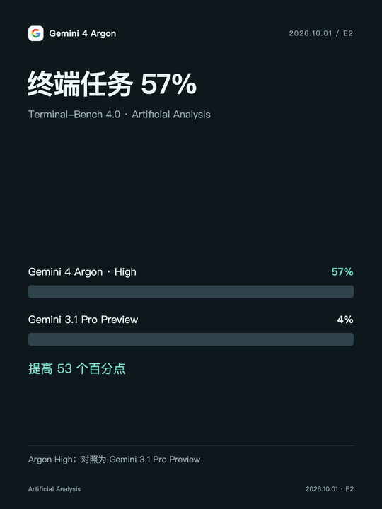

Terminal-Bench 4.0：Argon 57%，此前 Gemini 3.1 Pro Preview 为 4%。

[高清 MP4](docs/demos/zh/gemini-argon-terminal.mp4) · [下载 Live Photo](docs/demos/zh/gemini-argon-terminal.pvt.zip)

### 全球人口


[高清 MP4](docs/demos/zh/population.mp4)

### 咖啡门店

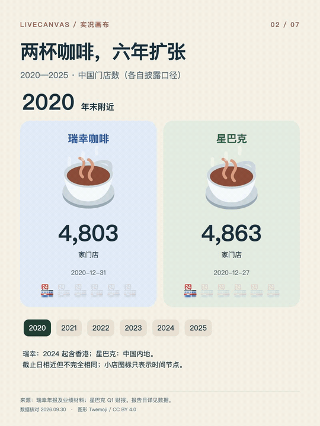

[高清 MP4](docs/demos/zh/coffee.mp4)

### 新能源车

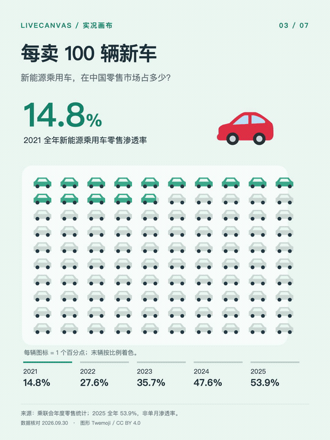

[高清 MP4](docs/demos/zh/nev.mp4)

### 中国高铁

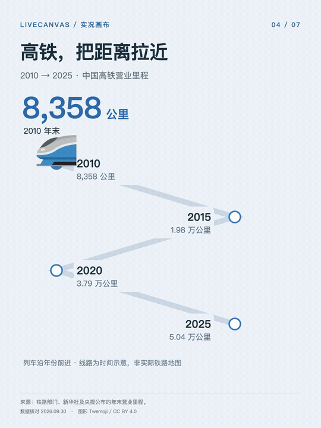

[高清 MP4](docs/demos/zh/rail.mp4)

### 双城气温

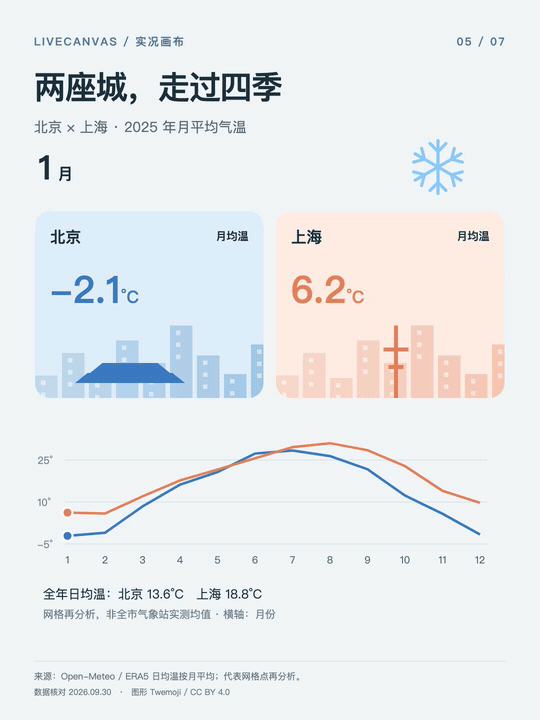

[高清 MP4](docs/demos/zh/weather.mp4)

### 奥运金牌

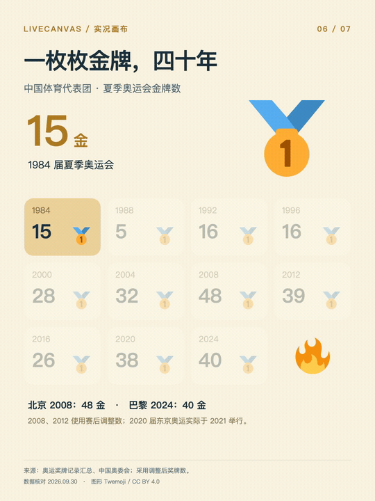

[高清 MP4](docs/demos/zh/olympics.mp4)

### 发电结构

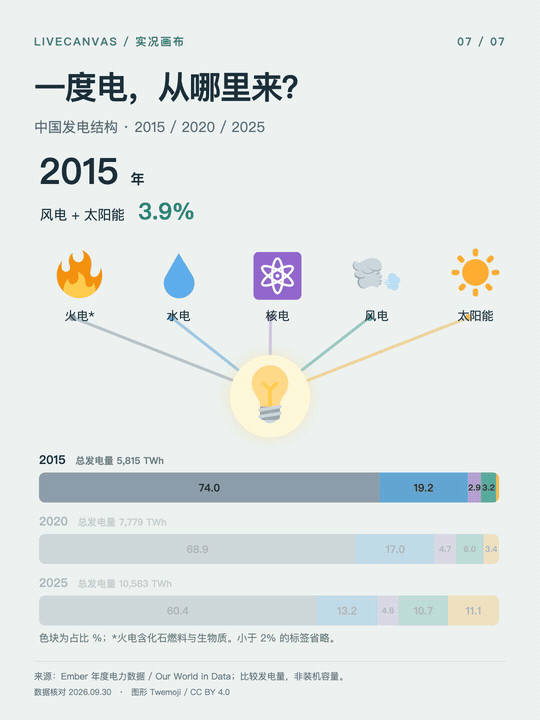

[高清 MP4](docs/demos/zh/energy.mp4)

数据为制作时的快照，不会自动更新。Gemini 图卡核对日期为 2026-10-01，Text Arena 榜单日期为 2026-09-30。来源与口径见 [演示说明](docs/DEMOS.md)。

## 安装

需要 Node.js / npm。使用 [Skills CLI](https://github.com/vercel-labs/skills) 安装，并选择你的 AI 助手：

```bash
npx skills add pengchujin/livecanvas --skill livecanvas -g
```

只装到 Codex：

```bash
npx skills add pengchujin/livecanvas --skill livecanvas -g -a codex
```

安装后新建对话，输入：

```text
用 LiveCanvas 做北京和上海去年全年气温变化。
加入城市插画和季节 emoji，设计完整封面，并提供动态预览。
```

<details>
<summary>手动安装到 Codex</summary>

下载或克隆本仓库，把整个 `livecanvas/` 文件夹放入 `~/.codex/skills/`；若设置了 `CODEX_HOME`，则放入该目录下的 `skills/`。不要只复制 SKILL.md。随后新建对话。

需要兼容旧的 `$livechart` 调用时，再把 `livechart/` 文件夹放到同一位置。

</details>

## 运行与交付

- **动画：** 助手需能联网搜索和执行代码；需 Node.js、Python 3、FFmpeg，以及内容对应的字体。项目用 `npm ci` 安装依赖。
- **Live Photo：** 配对封装额外需要 macOS 和 Xcode Command Line Tools。当前工具支持无声 H.264 + JPEG。
- **交付：** 封面、MP4、数据来源、可编辑工程，以及支持环境下的 `.pvt` 资源包；不自动导入相册。

`.pvt` 包含配对照片、视频及元数据，iPhone「文件」App 未必能直接预览。README 使用 GIF 展示动效，GIF 不是原生 Live Photo。

模板使用 Remotion 4.0.530。手动渲染与封装步骤见 [运行指南](livecanvas/references/production.md)。

## 许可与致谢

代码及 skill 文档采用 [MIT](LICENSE)；演示媒体与第三方素材许可见 [署名说明](THIRD_PARTY_NOTICES.md)。Remotion 适用其[自身许可证](https://github.com/remotion-dev/remotion/blob/main/LICENSE.md)。

动效设计参考 [Emil Kowalski / animate](https://github.com/emilkowalski/skills/blob/main/skills/animate/SKILL.md)，图标采用 [Twemoji](https://github.com/twitter/twemoji)。
