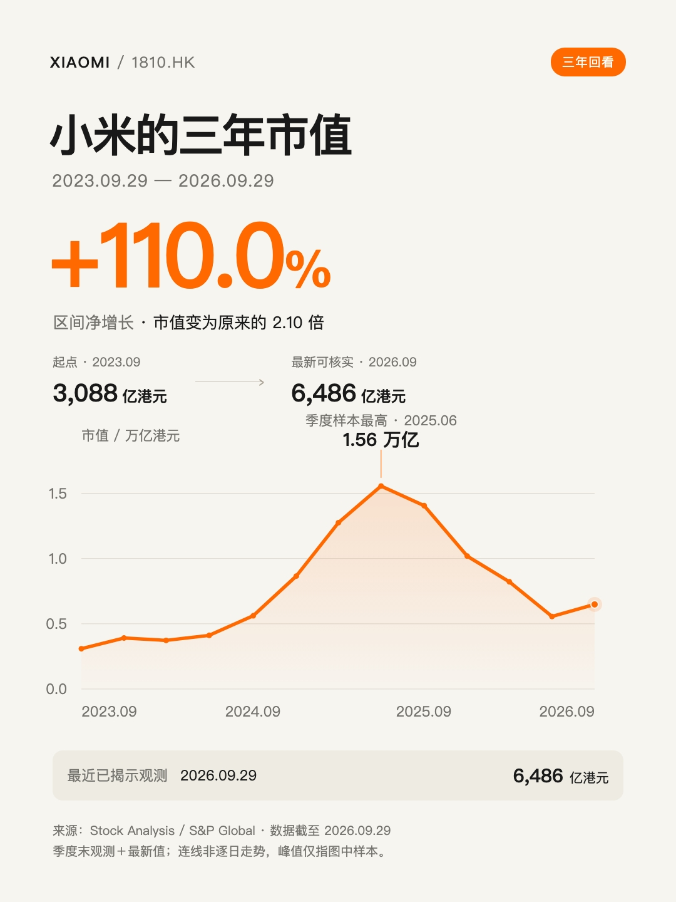
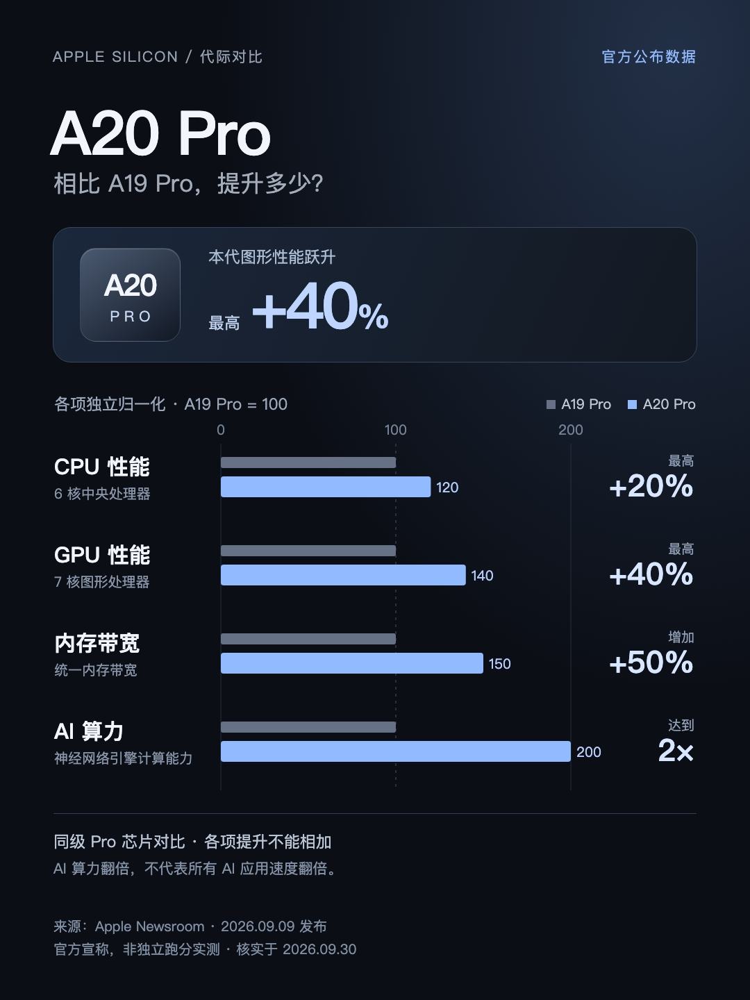
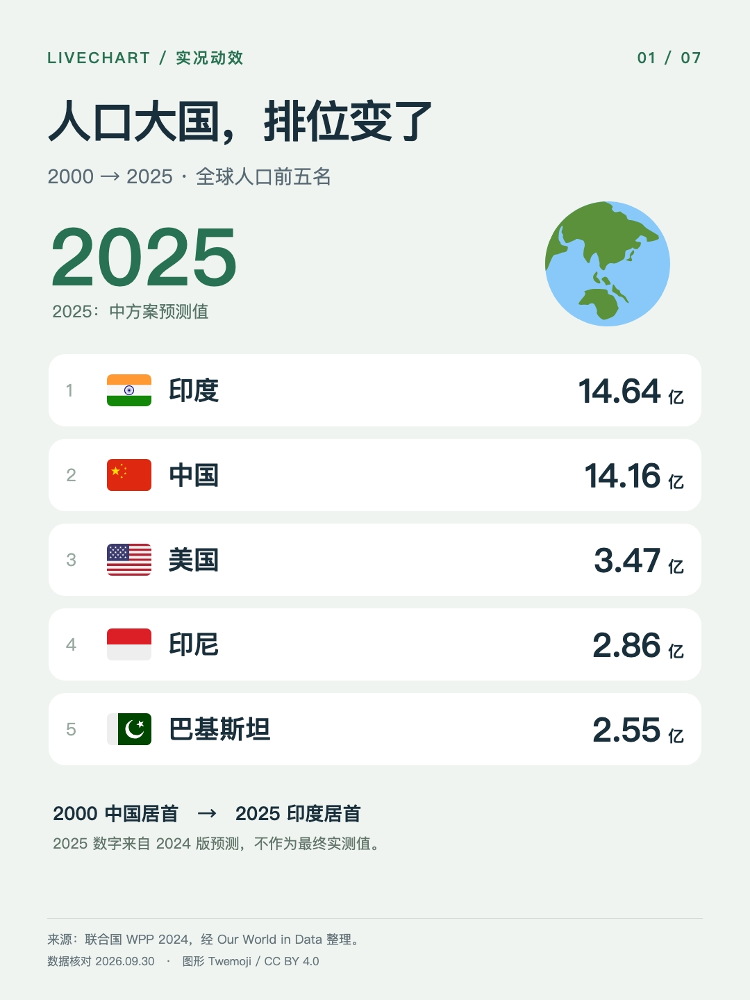
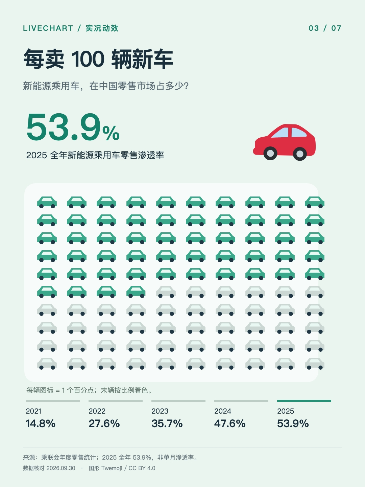
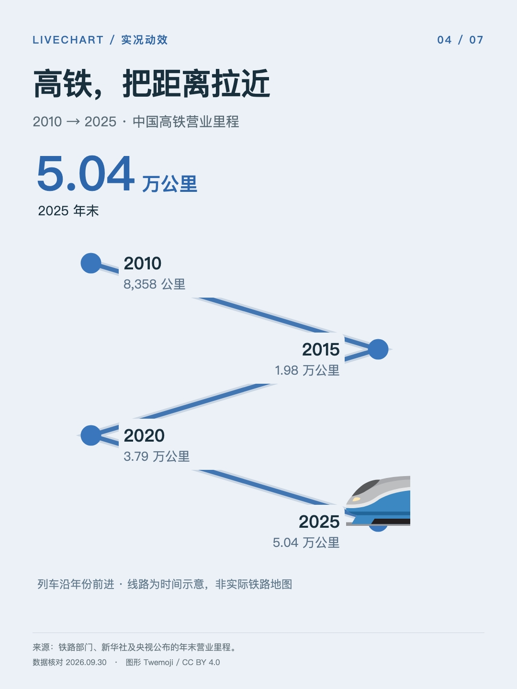
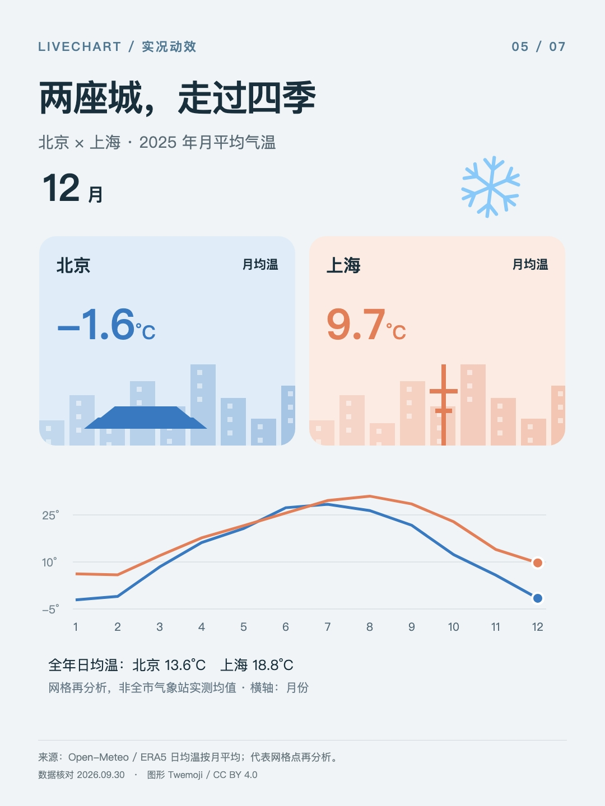
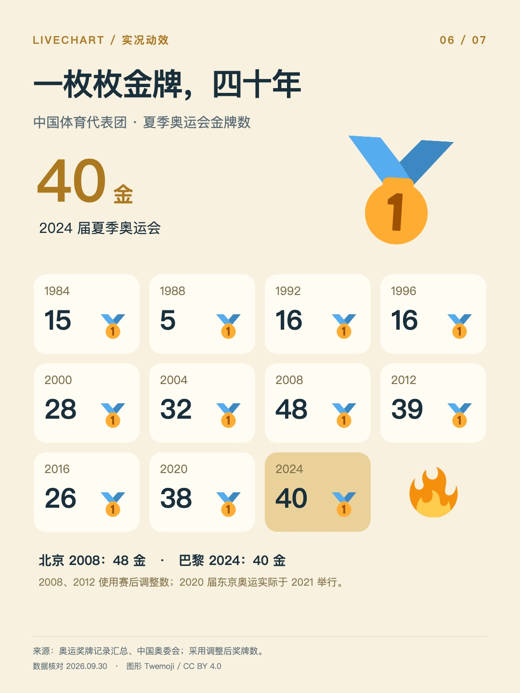
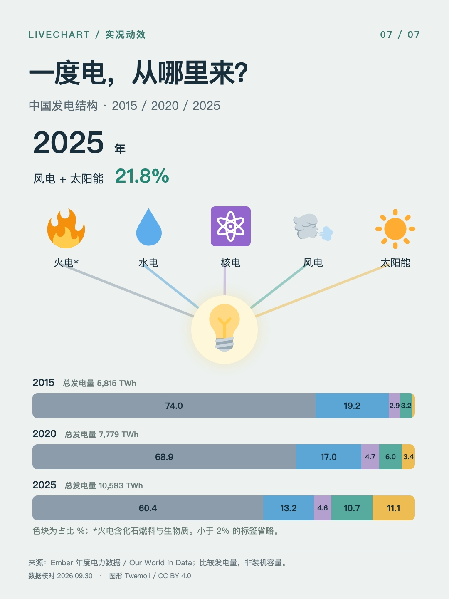

# LiveCanvas · 实况画布

把一句话，做成有封面、有图片、有动画的信息卡。

一个适用于 Codex、Claude Code 等 AI 编程助手的 skill：**搜索核实 → 设计分镜 → Remotion 动画 → 预览与 Live Photo 资源**。支持图片、emoji、场景、时间线和图表。

## 作品演示

下面是实际生成的 9 张作品。点击标题看 MP4 动画；图片是静态封面。作品保留更名前的 LiveChart 标记。

| [小米市值](docs/demos/xiaomi.mp4) | [A20 Pro vs A19 Pro](docs/demos/a20-pro.mp4) | [全球人口](docs/demos/population.mp4) |
| :---: | :---: | :---: |
|  |  |  |

| [咖啡门店](docs/demos/coffee.mp4) | [新能源车](docs/demos/nev.mp4) | [中国高铁](docs/demos/rail.mp4) |
| :---: | :---: | :---: |
|  |  |  |

| [双城气温](docs/demos/weather.mp4) | [奥运金牌](docs/demos/olympics.mp4) | [发电结构](docs/demos/energy.mp4) |
| :---: | :---: | :---: |
|  |  |  |

数据口径与素材署名见 [演示说明](docs/DEMOS.md)。这些是制作时的数据快照，不会自动更新。

## 安装

需要 Node.js / npm。使用 [Skills CLI](https://github.com/vercel-labs/skills) 安装，在提示中选择你的 AI 助手：

```bash
npx skills add pengchujin/livecanvas --skill livecanvas -g
```

只装到 Codex：

```bash
npx skills add pengchujin/livecanvas --skill livecanvas -g -a codex
```

安装后新建对话，输入：

```text
用 LiveCanvas 做北京和上海去年全年气温变化。
加入城市插画和季节 emoji，设计完整封面，并提供动态预览。
```

<details>
<summary>手动安装到 Codex</summary>

下载或克隆本仓库，把整个 `livecanvas/` 文件夹放入 `~/.codex/skills/`；若设置了 `CODEX_HOME`，则放入该目录下的 `skills/`。不要只复制 SKILL.md。随后新建对话。

需要兼容旧的 `$livechart` 调用时，再把 `livechart/` 文件夹放到同一位置。

</details>

## 运行条件与交付

- **制作动画：**助手需能联网搜索、执行代码；本地需 Node.js、Python 3、FFmpeg 和中文字体。项目依赖由 `npm ci` 安装，模板使用 Remotion 4.0.530。
- **生成 Live Photo：**额外需要 macOS 和 Xcode Command Line Tools（`xcode-select --install`）。当前配对工具支持无声 H.264 + JPEG；其他系统可制作封面与视频。
- **交付内容：**封面 JPG、动画 MP4、数据来源、可编辑工程，以及在支持环境中生成的 `.pvt` 实况资源包。不会自动导入相册。

**`.pvt` 是装有配对照片、视频和元数据的资源包。**它不等于手机可直接预览的单张照片；iPhone「文件」App 可能显示未知文件。网页播放、相册保存与手机实况播放须分别实现和验证。本仓库提供静态封面及 MP4 演示，未托管网页实况相册。

手动渲染与封装步骤见 [运行指南](livecanvas/references/production.md)。

## 许可与致谢

代码及 skill 文档采用 [MIT](LICENSE)；演示媒体与第三方素材许可见 [署名说明](THIRD_PARTY_NOTICES.md)。Remotion 适用其[自身许可证](https://github.com/remotion-dev/remotion/blob/main/LICENSE.md)。

动效设计参考 [Emil Kowalski / animate](https://github.com/emilkowalski/skills/blob/main/skills/animate/SKILL.md)，图标采用 [Twemoji](https://github.com/twitter/twemoji)。
